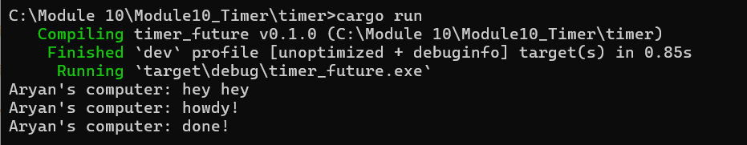
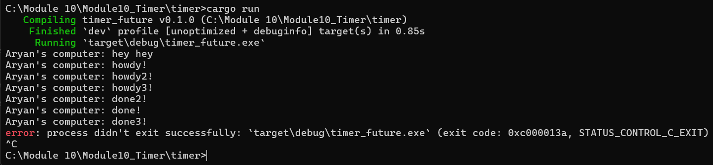
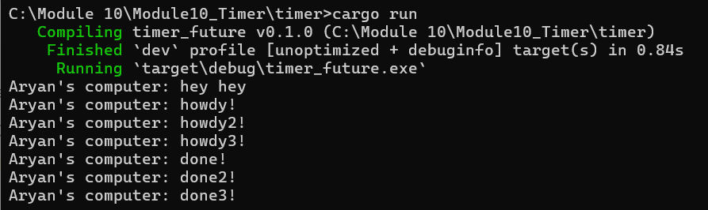

### Understanding how it works

println!("hey hey") dijalankan segera pada thread utama sebelum future yang dibuat (spawned) dijalankan (polled). Pemanggilan spawner.spawn hanya memasukkan async block ke dalam antrean executor; ini tidak langsung menjalankan isi block-nya. Ketika executor.run dimulai, ia akan mengambil (dequeue) dan menjalankan (poll) future-nya, yang menyebabkan “howdy!” dicetak. Lalu, timer mengembalikan Poll::Pending dan future tersebut memasukkan dirinya kembali ke antrean. Setelah dua detik, timer thread membangunkan tugas tersebut lewat waker yang telah disimpan, executor.run kembali menjalankan (poll) tugas tersebut, dan “done!” pun dicetak.

### Removing drop(spawner);

Pesan "howdy!" muncul berurutan karena langsung dicetak saat blok async pertama kali dijalankan. Sebaliknya, pesan "done!" muncul dalam urutan acak karena berasal dari timer yang selesai di waktu yang berbeda-beda. Karena eksekutor terus menunggu tugas baru akibat spawner tidak dihentikan, program tidak berhenti sendiri dan harus dihentikan secara manual.

### With drop(spawner);

Pesan "howdy!" muncul berurutan karena setiap blok async langsung mencetak saat dijalankan. Pesan "done!" juga muncul secara berurutan karena timer yang aktif setelah dua detik bangun bersamaan, sehingga pesan dicetak sesuai urutan bangunnya masing-masing timer.
