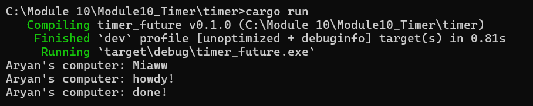

# Understanding how it works

println!("Miaww") dijalankan segera pada thread utama sebelum future yang dibuat (spawned) dijalankan (polled). Pemanggilan spawner.spawn hanya memasukkan async block ke dalam antrean executor; ini tidak langsung menjalankan isi block-nya. Ketika executor.run dimulai, ia akan mengambil (dequeue) dan menjalankan (poll) future-nya, yang menyebabkan “howdy!” dicetak. Lalu, timer mengembalikan Poll::Pending dan future tersebut memasukkan dirinya kembali ke antrean. Setelah dua detik, timer thread membangunkan tugas tersebut lewat waker yang telah disimpan, executor.run kembali menjalankan (poll) tugas tersebut, dan “done!” pun dicetak.